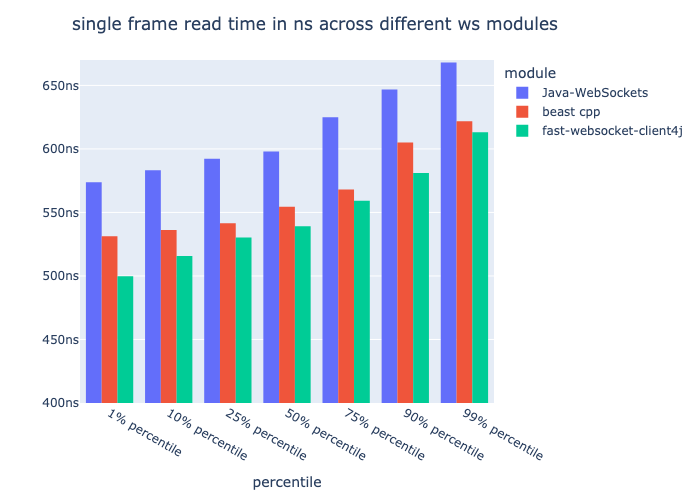

# Fast websocket client for Java

I wrote this project when I needed a *fast* websocket client. 
Note, this project is very specific to my use-case and probably 
does not generalize well to your needs.

Unfortunately, a lot of the *fast*ness comes from the fact that
a lot of WebSocket features are skipped over. Here are some
idiosyncrasies of this project:


## Lack of write speed

I don't care about writes. I'm not sending that much data, 
and the data I do send is very latency insensitive. For some reason, 
the servers which I'm talking to also don't care about my writes
via WebSockets. They only seem to care about sending data via REST.
For that reason, I'm out (on caring about writes).

The writes I send usually only happen way outside of the hotpath
so I don't mind allocations here. I believe there's a few in there...

## Thread Affinity

This client assumes a single reader thread only. This reader thread
should ideally be pinned to a core using something like Peter Lawrey's
awesome library [Java Thread Affinity](https://github.com/OpenHFT/Java-Thread-Affinity). The writer thread is spawned once
the socket connects and then lives in the background as a low priority thread.
I'm sure the writes can still work at a respectable speed but I haven't tested
it (nor am I going to).


## Lack of draft support

I support RFC6455 only. I might support compression extensions in the future.

## Lack of sub-protocol support

I do not implement any custom application-layer protocols. None of the servers
which I use this code for implement them, so I have no reason to. If you want to
add the ability to support custom protocols, by all means, submit a PR!
(But I'll probably close it unless it is performant!)

## I'm only a client

I'm only talking to other servers. There is no support for running a
WebSocket server within this library.

## I don't care about fragmentation

I always know the size of the messages I'm sending, so I don't worry
about fragmentation from the client perspective. However, I do not trust
any server which I talk to, so they very well may fragment their messages
on every single byte. I haven't implemented fragmentation parsing from the
server's messages yet, but maybe I will soon.

Read about fragmentation [here](https://datatracker.ietf.org/doc/html/rfc6455#section-5.4).

## Logging

Finally, something not overly specific (kinda)! I'm using `SLF4J` for logging.
If you want to speed up the logging, try `Chronicle-Logger`'s `SLF4J` backend.

## You're required to do the polling

Most websocket libraries will spawn both a reader and a writer thread to 
constantly pool the IO buffers on the socket. However, this is not the
case in this library. The use case here is for the calling code of 
`poll` to be pinned to a core purely only for reading from the IO stream.
This library is best for WebSockets which 99.9% of the traffic is against
reading input rather than writing.

## Assumes decent I/O familiarity

The main exchange of data between your code and this library's code
is through `ByteBuffer`s. If you are uncomfortable with byte buffers,
I'd suggest first learning those and then coming back to the library.

# Features

Here are some things which aren't as negative.

## It's fast

How fast you say? Well, here's a graph.



The code to generate these numbers exists in the `latency/` folder.
At a high level, this is the *rough* estimate of the time it takes to
consume one message from the wire. This is extrapolated by taking
200 samples of reading 1,000,000 messages of sequential numbers. Read more about
the latency and things on this [blog post](TODO).

## Limited allocations

There are zero allocations on the hot path of this code (depending on your `Socket` impl).
If you are unfamiliar of a hot path or what it entails, this may not be relevant for you.
Even further, depending on your `Socket` impl, there
are *zero* copies of the bytes which the NIC receives to when it is
delivered to your code (however, this is assuming you have the capability
of transferring NIC -> user space (kernel bypassing)). If you are running
JDK's default implementation of `SocketFactory`, the bytes will be copied
from kernel space -> user space -> the client's buffer. 

## Automatic reconnection

This library supports automatic detection of the connection being dropped
based off a timeout interval, and consequently automatic reconnection if
this is detected. The design uses a background thread to monitor when a byte
was last received on the wire, and if it exceeds the timeout threshold, will
reconnect the socket. Since this timeout thread runs in a background, this will
not be precise, but precise enough to function for my uses.

## Memory Management

The design considers memory management significantly. Our write queue uses the flyweight
pattern to reuse heap objects. Our recv buffer can fit into an L1 cache in its
entirety. All of our static allocations are cache-line aligned (interesting sentence).

## Kernel Bypass

This library makes no assumptions about where a `Socket` comes from --
it merely calles `createSocket(host, port)` from a `SocketFactory`. If you
are interested enough, send a socket facade which runs through some
Kernel bypassing software like [DPDK's](https://www.dpdk.org/). Note, I haven't created
my own Socket facade yet, and if I end up doing that, most likely will change
this contract between sockets and the WebSocket client.

# Installation

This package gets automatically pushed to [GitHub Packages](https://docs.github.com/en/packages/working-with-a-github-packages-registry/working-with-the-apache-maven-registry).

```xml
<repositories>
    <repository>
        <id>github</id>
        <name>Gnome Trading Group Repo</name>
        <url>https://maven.pkg.github.com/gnome-trading-group/*</url>
    </repository>
</repositories>

<dependencies>
    <dependency>
        <groupId>group.gnometrading</groupId>
        <artifactId>fast-websocket-client4j</artifactId>
        <version>{FIND THE LATEST VERSION ABOVE}</version>
    </dependency>
</dependencies>
```

If you bother me enough, maybe I'll publish it to Maven Central.

# Usage

Well, if you're still reading then all my implementation opinions seem
to not have deterred you. To the individual who is still thinking about
using this library, in one last opportunity to scare you away, I most
likely will *not* support any questions or issues you post. I only
open-sourced this because I like open-source.

Here's how to use the library:

### Default use case

```java
WebSocketClient webSocketClient = new WebSocketClient.Builder()
        .withURI(URI.create(/* some uri */))
        .withAutomaticReconnect(true)
        .build();
webSocketClient.connect(); // blocking

while (true) {
    ByteBuffer payload = webSocketClient.poll();
    String decode = StandardCharsets.UTF_8.decode(payload);
    System.out.println("Got a message: " + decode);
}
```

### Writing

```java
WebSocketClient webSocketClient = new WebSocketClient.Builder()
        .withURI(URI.create(/* some uri */))
        .withAutomaticReconnect()
        .build();
webSocketClient.connect(); // blocking

webSocketClient.write("Hey man, I connected");
// or send bytes

do {
    ByteBuffer payload = webSocketClient.poll();
    String decode = StandardCharsets.UTF_8.decode(payload);
} while (!decode.equals("Thanks for connecting man!"));

System.out.println("You found a new friend.");
```

### Using a `WebSocketListener`

```java
import group.gnometrading.websockets.*;

class MyAwesomeWebSocket implements WebSocketListener {
    private WebSocketClient client;

    public MyAwesomeWebScoket(URI uri) {
        this.client = new WebSocketClient.Builder()
                .withURI(uri)
                .withListener(this)
                .build();
        this.client.connect();
    }

    // Triggered only via main reader thread
    void onConnect() {
        System.out.println("We connected! Hallelujah~~~");
    }
    
    // Triggered via background write thread
    // Be careful of concurrent writes here
    void onWriteError(Exception e) {
        System.out.println("One of our messages failed to write...");
        e.printStackTrace();
    }

    // Triggered only via main reader thread
    void onClose() {
        System.out.println("The server force closed our connection...");
    }

    // Triggered via background timeout thread
    // Be careful of concurrent writes here
    void onTimeout() {
        System.out.println("The server has been neglecting us...  onConnect will be called in a second tho");
    }
}
```
